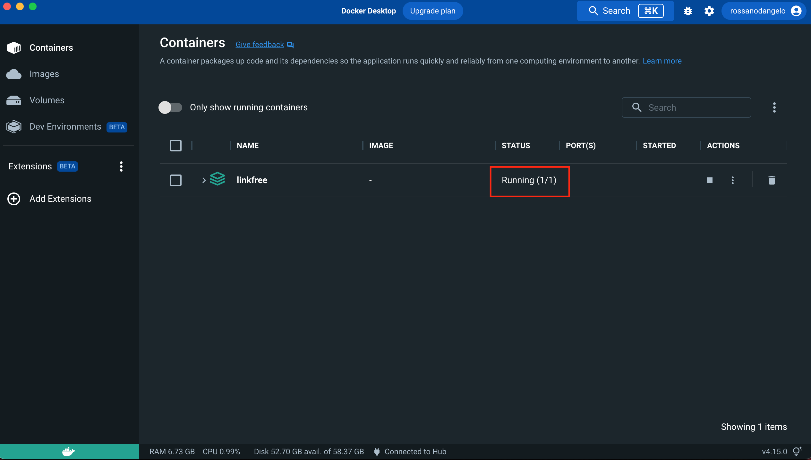
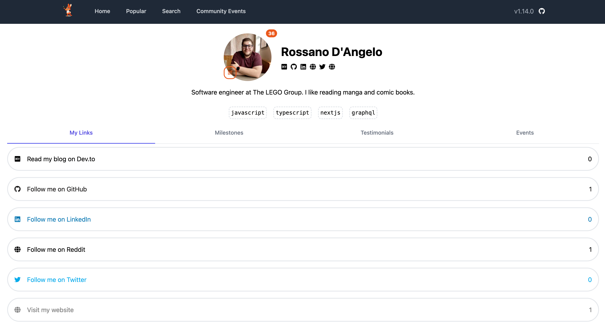

[Linktree](https://linktr.ee/) is a tool that allows you to gather many links in a single page that you can share so that people can find all your links in one place. The free plan offers unlimited links and a customizable profile to share but all the interesting features don't come for free.

[EddieHub](https://github.com/EddieHubCommunity), a Community of inclusive Open Source people, worked on a free alternative to Linktree, [LinkFree](https://github.com/EddieHubCommunity/LinkFree). Here's how I created my profile.

## Development environment setup

First of all, [fork](https://docs.github.com/en/get-started/quickstart/fork-a-repo) the [LinkFree repository](https://github.com/EddieHubCommunity/LinkFree) and clone it on your machine.

Now [download and install Docker](https://docs.docker.com/get-docker/), you will need it to run the MongoDB database. Once installed, you can login into your Docker account.

Make sure to have `node v18.12.1` and `npm v8.19.2` before installing the dependencies in the repository. I use [nvm](https://github.com/nvm-sh/nvm) to easily switch between different NodeJS versions.

Finally, navigate to the repository root folder and start up the project

```
cd my/path/LinkFree
npm install
docker-compose up
```

Check Docker to verify the container is up and running.



The last command starts up Docker MongoDB image. LinkFree provides a great [quickstart guide in its README](https://github.com/EddieHubCommunity/LinkFree#quickstart).

## Create your profile page

Creating your profile page is very easy. Open your forked repository in a code editor and add a JSON file in the `./data` folder, for example `rossanodan.json`. [Here](https://github.com/EddieHubCommunity/LinkFree/blob/main/data/rossanodan.json) you can see mine. There is a [detailed guide on how to add your profile](https://github.com/EddieHubCommunity/LinkFree#-to-add-your-profile) on the README of LinkFree.

Launch the app locally with `npm start` and open it in your browser. Search for your name and there it is! Your profile is ready!



## Push your changes

Now you can stage the changes - make sure to follow the [contribution guidelines](https://github.com/EddieHubCommunity/LinkFree/blob/main/docs/contributing/CONTRIBUTING.md) - commit and push. Finally [create a pull request in LinkFree](https://github.com/EddieHubCommunity/LinkFree/pulls) and wait it gets reviewed by the maintainers.

Easy, right? Here is my LinkFree profile https://linkfree.eddiehub.io/rossanodan.

A special thanks to [Eddie Jaoude](https://twitter.com/eddiejaoude) and the [EddieHub Community](https://github.com/EddieHubCommunity) for creating this great tool. If you wish to get involved, reach them out on the [Community Discord server](https://discord.gg/NZFapQasr7).
